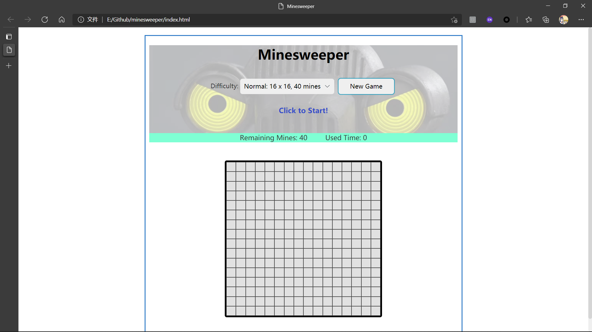
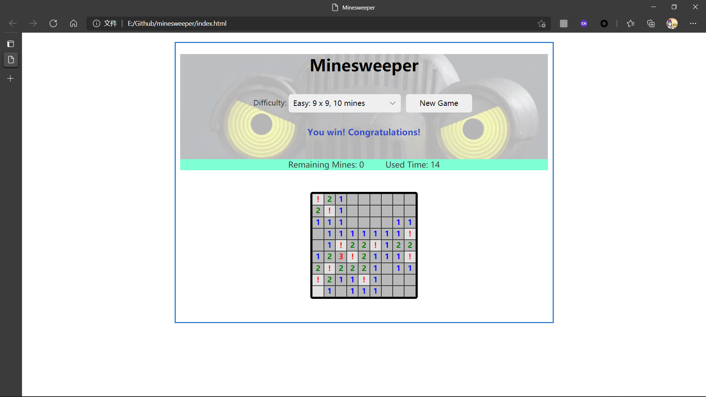
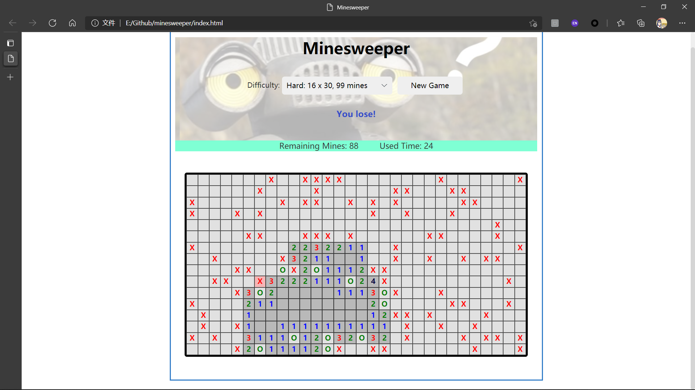

# minesweeper
 Javascript Minesweeper

by Allen-Yolk

Window10 / 11并不再自带扫雷，实在是很遗憾。因此，使用JavaScript，HTML和CSS来再现这款经典小游戏！[ 游戏规则应该就不用具体介绍了！]

### 功能概述

* 在Difficulty的下拉选择框选择想要游玩的难度，然后单击New Game开始游戏。不用担心，计时在首次点击之后才开始。

* 提示栏会显示当前剩余的地雷数量 (Remaining Mines) 和已经使用的时间 ( Used Time )。

  

* 运用智慧，完成游戏任务，正如小时候那样！支持以下游戏操作：

  * 左击 masked 方格：翻开该格子。第一次点击位置及其周边8格不会有雷，敬请放心！
  * 右击masked 方格：将该格子标记为雷。
  * 左键单击 / 左右键同时 / 摁滚轮 @ 一个数字格子：该格子被满足时，快速翻开其附近的格子。（难以描述，大家都懂的！）注意：如果数字格子周围的雷标记数 == 该数字，但雷标记错了地方，此时使用快速翻开操作，是会直接引爆地雷的！

* 标记出所有雷后，立即获得胜利（即使没有点开所有格子）。由于太菜，就放一张简单模式的胜利图片吧（x）

  

* 左键点击未标记的雷 / 快速翻开出现人为误判时，游戏失败。已经扫出的雷 、为扫出的雷、导致失败的雷使用不同标记来表示，方便复盘（bushi）。注：下图并非作者的真实实力。

  

* 默认背景图是赛文加战斗 / 迷惑姿态。（赛文加真是太可爱了）

### 进一步的想法

* 引入人机对抗（机器使坏，不改变现有盘面正确性的前提下，尽可能让人类解不出来这局扫雷。）尚在思考阶段，以后可能会更新！

### 致谢

​		感谢老师 & 助教！这门课上除了学到知识以外，还收获了很多编程思想；看着几个小项目，还挺有成就感的hhh。

